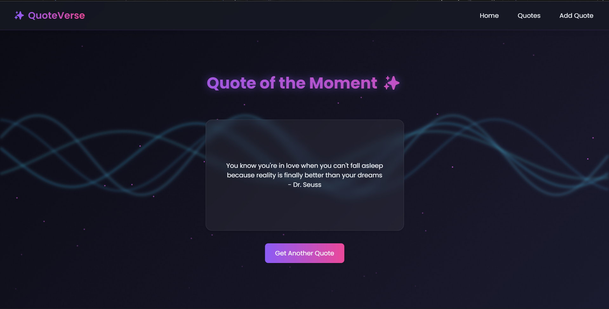
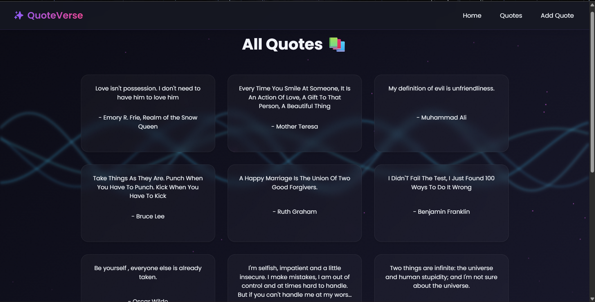
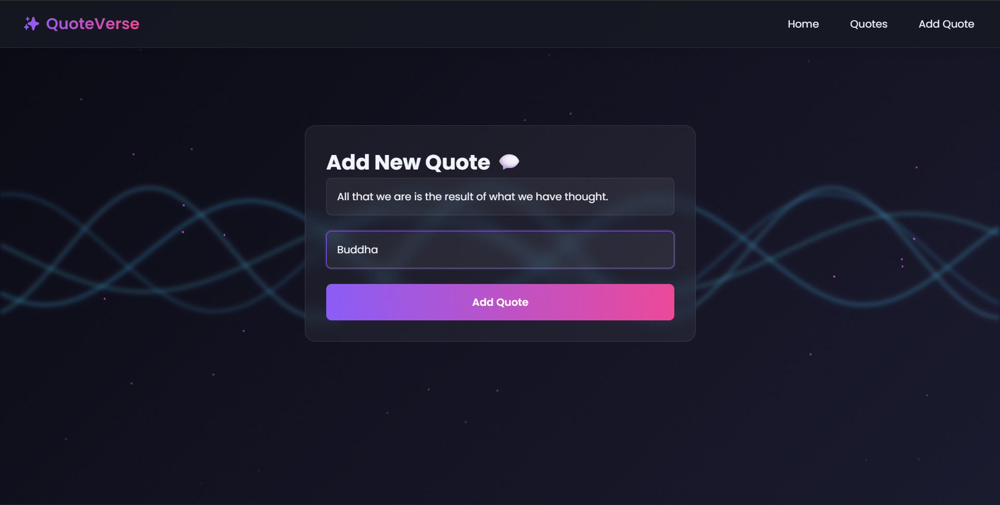

# 📝 Quote App


A modern, interactive web application to explore, add, and manage quotes.  

💡 **Live Demo:** [https://quote-sjaz.onrender.com](https://quote-sjaz.onrender.com)

---

## **Features**

- 🌟 Get a **Random Quote** for daily inspiration  
- 📚 View **All Quotes** in a beautiful, animated card layout  
- ✍️ **Add Your Own Quotes** with author information  
- 🗑️ **Delete Quotes** (available in the All Quotes section)  
- 📱 Fully **responsive** on mobile and desktop  
- 🎨 Sleek **glassmorphism design** with subtle animations  

---

## **Tech Stack**

### **Frontend**
  
  


### **Backend**
  
  
  

### **Deployment**


---

## **Screenshots**

  
  


---

## **API Endpoints**

| Method | Endpoint | Description |
|--------|----------|-------------|
| GET    | `/api/quotes/fetchallquotes` | Get all quotes |
| GET    | `/api/quotes/randomquote`    | Get a random quote |
| POST   | `/api/quotes/addquote`       | Add a new quote |
| DELETE | `/api/quotes/deletequote/:id`| Delete a quote |

---

## **Setup & Installation**

### **Backend**
```bash
git clone https://github.com/Adi-God-7/Quote.git
cd Quote/backend
npm install
